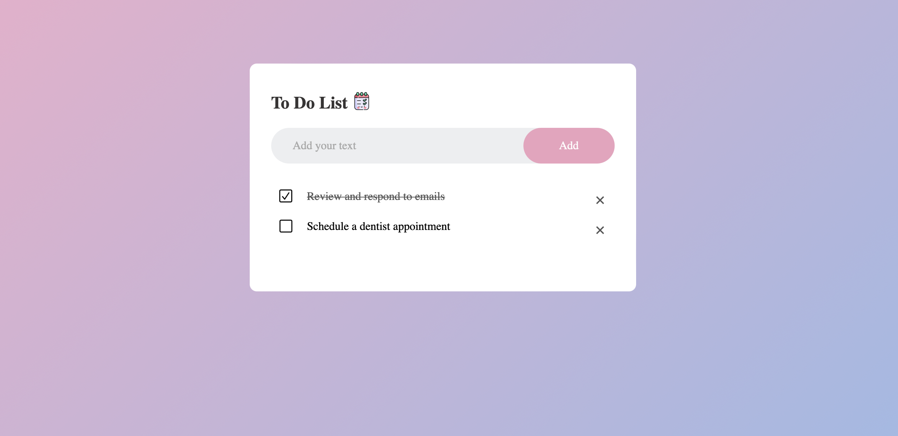

# To-Do List

This is a simple to-do list application.

### Features
- Add tasks
- Mark tasks as completed
- Delete tasks

### Usage
- Add your tasks in the input field and click "Add".
- Mark tasks as completed by clicking the checkbox.
- Delete tasks by clicking the delete button.

[Demo]([[[file:///Users/ummayrahman/Desktop/To%20do%20List/index.html]](https://raw.githubusercontent.com/ummayrahman/todo-list/main/To%20do%20List/index.html)](https://66788163a47af8d7abd36cb4--thriving-eclair-22ae7c.netlify.app))

